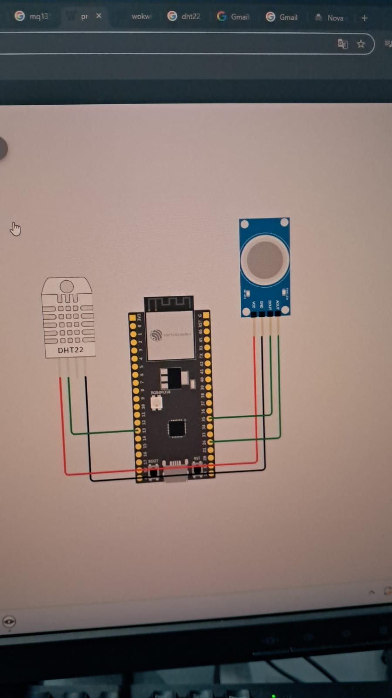

# Ferramentas que serão usadas
Sensor de gás (MQ135)  
Sensor de Umidade / Temperatura (DHT11)  
Esp32  
Resistor  
Cabos  
Protoboard

# Formato de Dados (Json)
Temperatura:  
Umidade:  
Co2:  
(alguns outros gases a decidir):  
Datatime:

# Banco de Dados 
 Postgresql

# Tecnlogias/linguagem
C# / React / Typescript

# Plataforma 
Wokwi

# Esquema Projeto

# Members 
Breno henrique  
Caio Ocon  
Leandro Poletti  
Leticia  
Laura